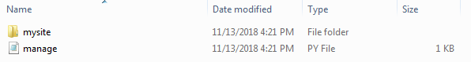
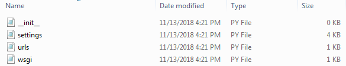
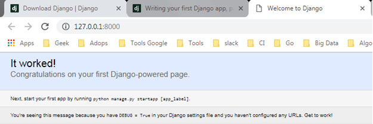

# Auto generates process :
in django framework you will be choosen, choice to starting build a websites. first you can build from the scratch or seconds you can starting using auto generates process from django.
basically you can choose one of the multiple choice, in this case i will be explain how to starting with auto generates. step by step is like this :
1. you just type this command for running auto generates :
`django-admin startproject name_folder` 
result of command will generates folders

2. how to running on your server :
`python manage.py runserver`

