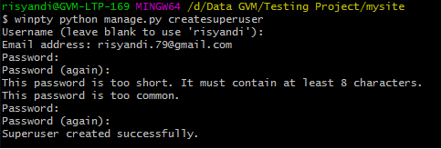
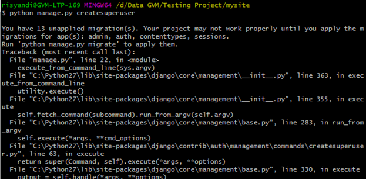

# Create super admin
for the create super admin you can type this command:  
`python manage.py createsuperuser`  
***noted** : If you have any problem as like this*  

  
You should run this command  
`python manage.py migrate`  

  
for this example users will be created with username and password is `admin`